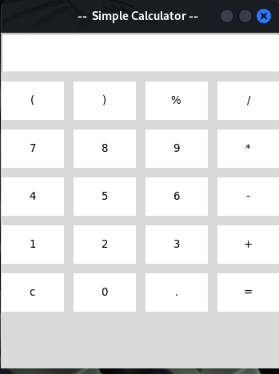
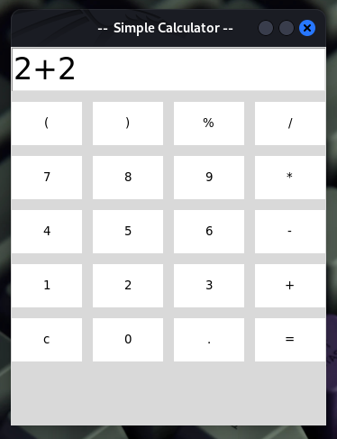

# Tkinter Calculator (Python)





This repository contains a simple calculator application built using the Tkinter library in Python.

## Features

* Basic arithmetic operations: addition, subtraction, multiplication, division
* Parentheses support
* Percentage calculation
* Clear button to reset the input
* Error handling for invalid expressions

## Usage

1. **Clone the repository:**
   ```bash
   git clone https://github.com/rarifyx/Tkinter-Calculator-Python-.git
   ```

2. **Navigate to the project directory:**
   ```bash
   cd Tkinter-Calculator-Python-
   ```

3. **Run the application:**
   ```bash
   python calculator.py
   ```

## How it Works

The calculator is implemented as a class `Calculator` that utilizes Tkinter widgets to create the user interface. 

* **Entry widget:** Displays the input and result.
* **Buttons:** Provide numerical input, operators, and functions.

The `show()` method appends user input to the entry widget. The `clear()` method resets the input. The `solve()` method evaluates the expression entered by the user and displays the result.

## Contributing

Contributions are welcome! Feel free to open an issue or submit a pull request to:

* Add new features
* Improve existing functionality
* Fix bugs
* Enhance the user interface

## License

This project is licensed under the MIT License. See the [LICENSE](LICENSE) file for details.
